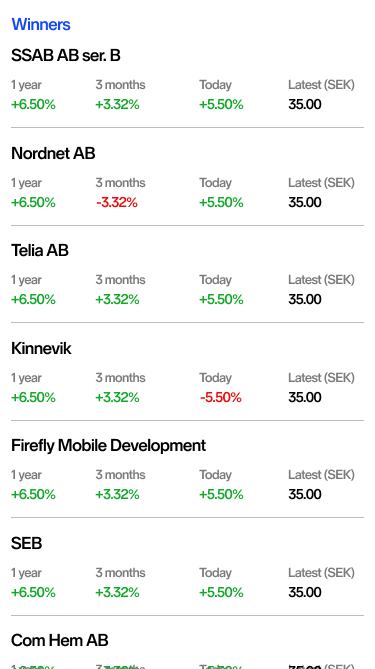

## Introduction

This is the demo app that is being used for interviewing at Nordnet for the mobile app team. The app is made in a way so that it reflects how the code is written and structured in the real Nordnet app. This is done because we want the interview to resemble a normal working day in the Nordnet app team, where we discuss code, we stay transparent, we ask each other questions and more.

We will work on the task together as a team where there will be no pressure in finishing the task, that is not what is important. We are just going to work together for a while so just relax and enjoy.

### How do I prepare?

1. Clone the repo to your machine.
2. Setup the react-native development environment. You can find instructions below.
3. Make it run on Android or iOS.
4. Install mob tool: https://github.com/remotemobprogramming/mob
5. Make sure that your GitHub account has **two-factor authentication** enabled. Otherwise you would not be able to push code.
6. Look through the source code a bit.

### Setting up the environment

Follow the guide that the official React Native docs provide: https://reactnative.dev/docs/environment-setup

If you are on MacOS run `yarn` and `cd ios && pod install` before starting Metro and the simulator.

If you are on another operating system run `yarn` and start the app in an Android emulator.

### How to run the app

Run the Metro bundler first by running:

```
yarn start
```

Run the app on iOS or Android by running:

```
yarn ios
yarn android
```

Run the tests for all test files by running:

```
 yarn test
```

Or in jest watch mode:

```
yarn tdd
```

Run tests for a specific file by running:

```
yarn test my/path/to/test/file
```

### What we are going to do?

Our task is to load the best/worse performing stocks from todays market and display them in a list. We will try and create a layout that will be similar to the image below:



We will not focus on getting the design 100% correct, 75% will be good enough.

User should be able to switch between them by tapping on the link above the list.

The app comes prepared with parts of fetching for the winners(best stocks) and losers(worst stocks) implemented. You can take a look in the `src/ducks` folder to see what's going on.

### Questions?

If you have any questions or if something isn't working properly feel free to contact [Daniel](daniel.sjostrom@nordnet.se) or [Nikolay](nikolay.demyankov@nordnet.se)

test1
